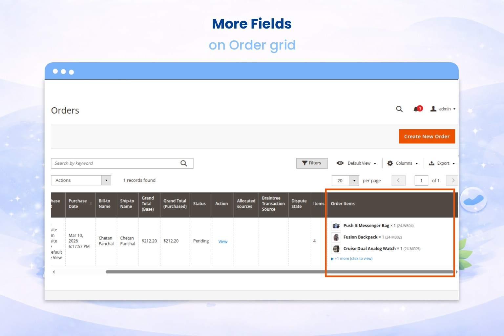
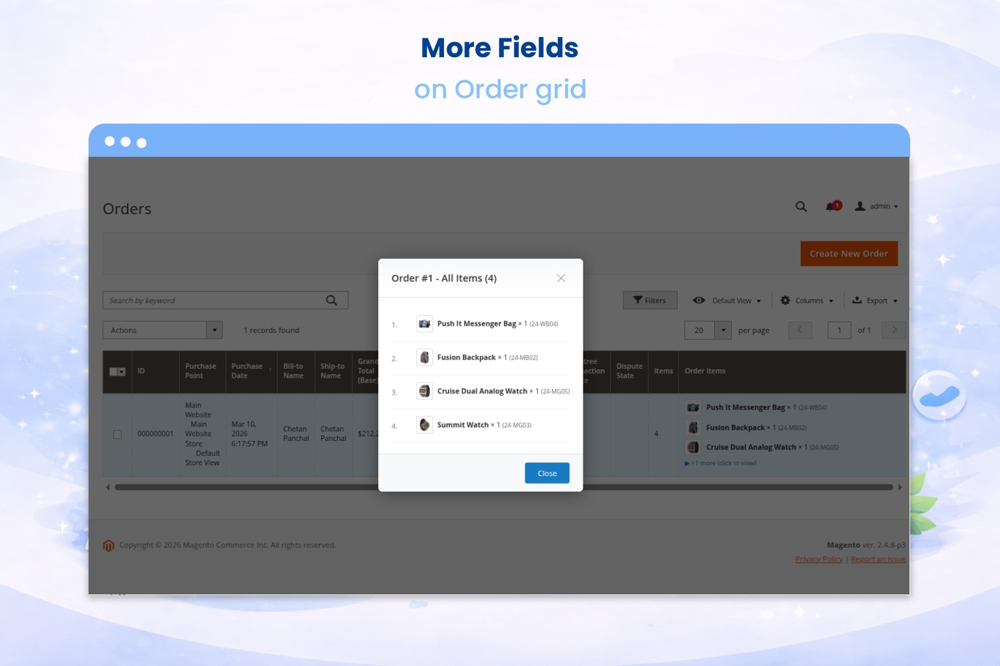
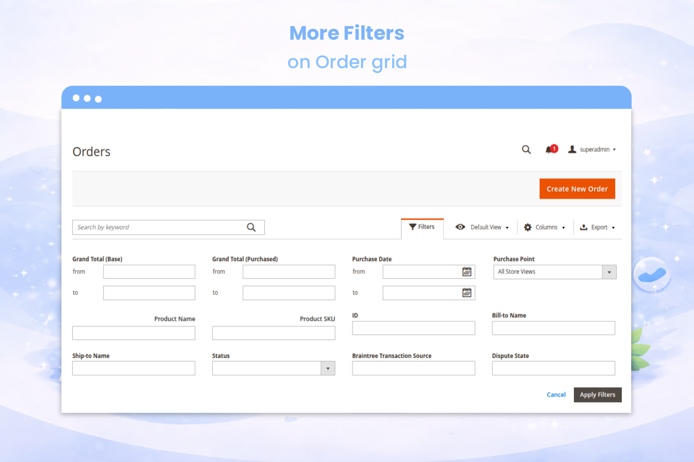

# Thinkbeat Smart Order Grid

A free, open-source Magento 2 module that enhances the admin sales order grid by adding an **Order Items** column, allowing administrators to quickly view product details without opening individual orders.

[](LICENSE.txt)
[](https://magento.com/)
[](https://magento.com/)

---

## 🎯 What Problem Does This Solve?

As a Magento store administrator, viewing what products were purchased in an order requires:
1. Opening the order detail page
2. Scrolling to the items section
3. Navigating back to the grid

**This module eliminates these steps** by displaying order items directly in the grid:

```
📦 Order Items Column:
─────────────────────────────
iPhone 15 Pro × 2 (SKU-12345)
AirPods Pro × 1 (SKU-67890)
+2 more
```

Perfect for:
- Quick order verification
- Customer service representatives
- Fulfillment teams
- Inventory managers
- Anyone who processes orders daily

---

## ✨ Features

- **🚀 Zero Configuration** — Install and it works immediately
- **⚡ Performance Optimized** — Uses efficient SQL JOINs (no N+1 queries)
- **📊 Clean Display** — Shows product name, SKU, and quantity
- **🎨 Smart Truncation** — Displays first 3 items, "+X more" for larger orders
- **🔍 Hover Tooltip** — Hover over "+X more" to see remaining items in tooltip
- **👆 Click to Expand** — Click "+X more" to expand and see all items inline
- **🖼️ Product Thumbnails** — Automatically shows product images next to items (optional)
- **🔢 Item Count Column** — Lightweight column showing total number of items per order
- **🔎 Search by Product** — Filter orders by product name or SKU using grid search
- **🔒 Security First** — All output properly escaped
- **🎯 No Core Overrides** — Uses Magento's UI Component extension
- **📦 Production Ready** — Follows Magento coding standards

---

## 📋 Requirements

- Magento 2.3.7 or higher
- Magento 2.4.x (all versions)
- PHP 7.3, 7.4, 8.1, or 8.2

---

## 📥 Installation

### Method 1: Composer (Recommended)

```bash
composer require thinkbeat/module-smart-order-grid
php bin/magento module:enable Thinkbeat_SmartOrderGrid
php bin/magento setup:upgrade
php bin/magento setup:di:compile
php bin/magento setup:static-content:deploy -f
php bin/magento cache:flush
```

### Method 2: Manual Installation

1. Download or clone this repository
2. Create directory structure:
   ```bash
   mkdir -p app/code/Thinkbeat/SmartOrderGrid
   ```

3. Copy module files to:
   ```
   app/code/Thinkbeat/SmartOrderGrid/
   ```

4. Enable and install:
   ```bash
   php bin/magento module:enable Thinkbeat_SmartOrderGrid
   php bin/magento setup:upgrade
   php bin/magento setup:di:compile
   php bin/magento setup:static-content:deploy -f
   php bin/magento cache:flush
   ```

---

## 🎬 Usage

**No configuration required!**

After installation:

1. Navigate to **Admin Panel** → **Sales** → **Orders**
2. Look for the new **Order Items** column
3. View product details directly in the grid

### Column Display Format

- **Single item**: `Product Name × Quantity (SKU)` with thumbnail
- **Multiple items** (≤3): Each item on a new line with thumbnail
- **Large orders** (>3): First 3 items + `+X more (click to expand)`
  - Hover to see tooltip with all remaining items
  - Click to expand/collapse all items inline

### New Columns Added

1. **Items** - Shows the total count of items in each order (sortable, filterable)
2. **Order Items** - Shows detailed product list with thumbnails and expandable view

### Search & Filter

Use the grid search box to filter orders by:
- Product name
- Product SKU
- Item count

---

## 🏗️ Technical Architecture

### Module Structure

```
Thinkbeat_SmartOrderGrid/
├── registration.php
├── composer.json
├── etc/
│   ├── module.xml
│   ├── di.xml
│   └── adminhtml/
│       └── ui_component/
│           └── sales_order_grid.xml
├── Plugin/
│   └── AddOrderItemsToGrid.php
└── Ui/
    └── Component/
        └── Listing/
            └── Column/
                └── OrderItems.php
```

### How It Works

1. **Plugin** (`AddOrderItemsToGrid.php`):
   - Intercepts the sales order grid collection
   - Adds efficient SQL JOIN with `GROUP_CONCAT`
   - Fetches all order items in a single query

2. **UI Component** (`OrderItems.php`):
   - Receives concatenated order items data
   - Formats HTML output with proper escaping
   - Handles truncation and tooltip generation

3. **Grid Extension** (`sales_order_grid.xml`):
   - Declares the new column in Magento's UI Component
   - Positions it after standard columns
   - Disables filtering/sorting (not applicable for concatenated data)

---

## 🔧 Customization

### Change Maximum Visible Items

Edit `Ui/Component/Listing/Column/OrderItems.php`:

```php
// Change from 3 to your preferred number
private const MAX_VISIBLE_ITEMS = 5;
```

### Modify Display Format

Customize the `formatSingleItem()` method in `OrderItems.php` to adjust:
- Product name length
- SKU display position
- Quantity formatting
- Styling

---

## 🧪 Testing

After installation, test with:

1. **Small orders** (1-3 items) — Should display all items
2. **Large orders** (>3 items) — Should show "+X more" with tooltip
3. **Grid performance** — Should load without delay
4. **XSS protection** — Try special characters in product names

---

## 🤝 Contributing

Contributions are welcome! Please:

1. Fork the repository
2. Create a feature branch (`git checkout -b feature/amazing-feature`)
3. Commit your changes (`git commit -m 'Add amazing feature'`)
4. Push to the branch (`git push origin feature/amazing-feature`)
5. Open a Pull Request

---

## 🐛 Known Issues

- **Filtering/Sorting**: Not supported for the Order Items column (by design, as it's aggregated data)
- **Very Long SKUs**: May affect column width on smaller screens

---

## 📝 Changelog

### Version 1.0.0 (2026-01-28)
- Initial release
- Order Items column with product name, SKU, and quantity
- Performance-optimized with single SQL query
- Smart truncation after 3 items
- Tooltip support for hidden items

---

## 📄 License

This module is licensed under the **MIT License**.

```
MIT License

Copyright (c) 2026 Thinkbeat

Permission is hereby granted, free of charge, to any person obtaining a copy
of this software and associated documentation files (the "Software"), to deal
in the Software without restriction, including without limitation the rights
to use, copy, modify, merge, publish, distribute, sublicense, and/or sell
copies of the Software, and to permit persons to whom the Software is
furnished to do so, subject to the following conditions:

The above copyright notice and this permission notice shall be included in all
copies or substantial portions of the Software.

THE SOFTWARE IS PROVIDED "AS IS", WITHOUT WARRANTY OF ANY KIND, EXPRESS OR
IMPLIED, INCLUDING BUT NOT LIMITED TO THE WARRANTIES OF MERCHANTABILITY,
FITNESS FOR A PARTICULAR PURPOSE AND NONINFRINGEMENT. IN NO EVENT SHALL THE
AUTHORS OR COPYRIGHT HOLDERS BE LIABLE FOR ANY CLAIM, DAMAGES OR OTHER
LIABILITY, WHETHER IN AN ACTION OF CONTRACT, TORT OR OTHERWISE, ARISING FROM,
OUT OF OR IN CONNECTION WITH THE SOFTWARE OR THE USE OR OTHER DEALINGS IN THE
SOFTWARE.
```

---

## 👨‍💻 Author

**Thinkbeat**
- Website: https://thinkbeatsolutions.com/
- GitHub: [@thinkbeat](https://github.com/thinkbeat-solutions)

---

## 🙏 Support

If you find this module helpful:
- ⭐ Star this repository
- 🐛 Report issues on GitHub
- 💡 Suggest new features
- 📢 Share with the Magento community

---

## 📸 Screenshots

Here is the Order Items column in action:

<div align="center">
  
  
</div>
<div align="center">
  
  
</div>

---

<div align="center">
  <strong>Made with ❤️ for the Magento Community</strong>
</div>
